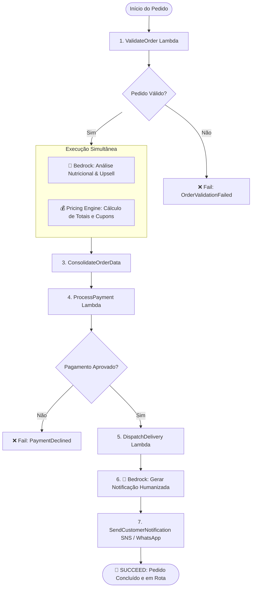

# 🛵 Assistente de Delivery Inteligente com AWS Step Functions e Amazon Bedrock

Um assistente autônomo e inteligente para plataformas de delivery de alimentos, construído com arquitetura Serverless orientada a eventos utilizando **AWS Step Functions** para orquestração de estados e **Amazon Bedrock** (com modelos fundacionais como Anthropic Claude 3 Haiku / Titan) para análise de restrições alimentares, recomendações de harmonização culinária (cross-selling) e geração de mensagens humanizadas de entrega.

---

## 📋 Sumário
1. [Visão Geral da Solução](#-visão-geral-da-solução)
2. [Arquitetura e Fluxo de Estados](#-arquitetura-e-fluxo-de-estados)
3. [Papel da IA Generativa (Amazon Bedrock)](#-papel-da-ia-generativa-amazon-bedrock)
4. [Estrutura do Projeto](#-estrutura-do-projeto)
5. [Pré-requisitos](#-pré-requisitos)
6. [Guia de Deploy na AWS](#-guia-de-deploy-na-aws)
   - [Opção 1: AWS SAM (Recomendado)](#opção-1-aws-sam-recomendado)
   - [Opção 2: Terraform](#opção-2-terraform)
7. [Como Testar e Simular Localmente](#-como-testar-e-simular-localmente)
8. [Exemplos de Payloads](#-exemplos-de-payloads)
9. [Segurança e Resiliência](#-segurança-e-resiliência)

---

## 🌟 Visão Geral da Solução

O **Assistente de Delivery** orquestra todo o ciclo de vida de um pedido de comida em tempo real:
- **Validação de Integridade**: Checa consistência de dados do cliente, itens e pagamento.
- **Processamento Paralelo Inteligente**:
  - **Amazon Bedrock**: Analisa os itens do pedido para identificar perfis alimentares (Vegano, Sem Glúten, Carnívoro), emitir alertas de alérgenos e sugerir harmonizações de acompanhamentos/bebidas.
  - **Pricing Engine**: Calcula subtotal, aplicação de cupons dinâmicos (`BEMVINDO10`, `BEDROCK15`, `FRETEGRATIS`) e taxa de entrega progressiva.
- **Processamento e Captura de Pagamento**: Valida e autoriza a transação com desvios em caso de recusa.
- **Despacho Logístico**: Seleciona o melhor entregador disponível e calcula a estimativa de entrega (ETA).
- **Comunicação Humanizada com IA**: O Amazon Bedrock gera mensagens personalizadas e empáticas enviadas diretamente para o WhatsApp ou SMS do cliente.

---

## 📐 Arquitetura e Fluxo de Estados



---

## 🧠 Papel da IA Generativa (Amazon Bedrock)

O **Amazon Bedrock** atua em duas frentes fundamentais dentro da máquina de estados:

1. **Classificação Culinária e Análise de Alérgenos (`analyze_preferences`)**:
   - Detecta restrições como celíacos, intolerância à lactose, dietas veganas ou vegetarianas com base nos nomes dos pratos e instruções especiais.
   - Gera sugestões de acompanhamentos para pedidos futuros.
   - Emite alertas proativos de segurança alimentar.

2. **Engajamento e Comunicação Empática (`generate_notification`)**:
   - Transforma dados brutos (tempo estimado, nome do entregador, pratos escolhidos) em uma mensagem acolhedora e personalizada, aumentando a satisfação do cliente no momento da confirmação.

---

## 📂 Estrutura do Projeto

```text
.
├── events/                              # Payloads de teste para simulação e validação
│   ├── order_valid.json                 # Pedido padrão bem-sucedido com cupom
│   ├── order_vegan_custom.json          # Pedido com restrições severas de alérgenos
│   ├── order_payment_declined.json      # Simulação de erro de pagamento
│   └── order_missing_fields.json        # Simulação de falha de validação
│
├── lambdas/                             # Código-fonte das funções AWS Lambda
│   ├── validate_order/                  # Validação estrutural do pedido
│   ├── bedrock_handler/                 # Integração com Amazon Bedrock (Claude 3 / Titan)
│   ├── pricing_engine/                  # Mecanismo de preços, frete e descontos
│   ├── payment_processor/               # Processador de pagamento e autorização
│   ├── delivery_dispatcher/             # Alocação de motoboys e cálculo de ETA
│   └── notification_sender/             # Envio de notificações via AWS SNS / canais
│
├── prompts/                             # Templates de engenharia de prompt para o Bedrock
│   ├── dietary_and_upsell.md            # Prompt de análise nutricional e cross-selling
│   └── customer_notification.md         # Prompt de redação de mensagens ao cliente
│
├── statemachine/                        # Definição do AWS Step Functions
│   └── delivery_assistant.asl.json      # Especificação em Amazon States Language (ASL)
│
├── terraform/                           # Infraestrutura como Código (Terraform)
│   ├── main.tf                          # Recursos Lambda, IAM e Step Functions
│   ├── variables.tf                     # Variáveis de região e modelo Bedrock
│   └── outputs.tf                       # ARNs e identificadores de saída
│
├── scripts/                             # Scripts utilitários e de simulação local
│   └── simulate_pipeline.py             # Simulador do fluxo completo sem depender da nuvem
│
├── tests/                               # Testes unitários das funções Lambda
│   └── test_flow.py                     # Suíte de testes com unittest
│
├── template.yaml                        # Infraestrutura como Código com AWS SAM
├── requirements.txt                     # Dependências Python
└── README.md                            # Documentação completa do projeto
```

---

## ⚙️ Pré-requisitos

1. **Conta AWS Ativa** com permissões para:
   - AWS Step Functions
   - AWS Lambda
   - Amazon Bedrock
   - AWS SNS
   - AWS IAM
2. **Habilitar Acesso aos Modelos no Bedrock**:
   - No AWS Console, vá para **Amazon Bedrock** > **Model access** e solicite acesso ao modelo **Anthropic Claude 3 Haiku** ou **Amazon Titan Text**.
3. **Ferramentas Locais (Opcional para Deploy)**:
   - Python 3.10+
   - AWS CLI configurado (`aws configure`)
   - AWS SAM CLI ou Terraform CLI

---

## 🚀 Guia de Deploy na AWS

### Opção 1: AWS SAM (Recomendado)

O AWS SAM compila o template e cria automaticamente as permissões IAM de menor privilégio e a State Machine:

```bash
# 1. Validar o template
sam validate

# 2. Compilar os recursos
sam build

# 3. Fazer o deploy guiado
sam deploy --guided
```

### Opção 2: Terraform

Se preferir utilizar Terraform:

```bash
cd terraform

# Inicializar os provedores
terraform init

# Visualizar o plano de execução
terraform plan

# Aplicar o provisionamento
terraform apply -auto-approve
```

---

## 🧪 Como Testar e Simular Localmente

Você pode executar o fluxo de ponta a ponta na sua máquina local sem custos de nuvem ou necessidade imediata de credenciais:

### 1. Executar a Simulação Completa

```bash
python scripts/simulate_pipeline.py
```
O script exibirá um menu interativo para você escolher qual cenário deseja testar:
- `[1] order_valid.json` (Fluxo completo de sucesso)
- `[2] order_vegan_custom.json` (Análise dietética de alérgenos e personalização)
- `[3] order_payment_declined.json` (Interrupção por recusa de pagamento)
- `[4] order_missing_fields.json` (Falha na etapa inicial de validação)

### 2. Executar os Testes Unitários

```bash
python -m unittest tests/test_flow.py
```

---

## 📦 Exemplos de Payloads

### Exemplo de Entrada (`events/order_vegan_custom.json`):
```json
{
  "order_id": "ORD-2026-5531",
  "customer": {
    "id": "CUST-891",
    "name": "Lucas Alencar",
    "phone": "+5521977776666",
    "address": "Rua Visconde de Pirajá, 300 - Ipanema, Rio de Janeiro - RJ"
  },
  "coupon_code": "BEDROCK15",
  "items": [
    {
      "item_id": "ITM-10",
      "name": "Pizza Individual Cogumelos com Queijo de Castanhas",
      "quantity": 1,
      "price": 54.00
    },
    {
      "item_id": "ITM-11",
      "name": "Suco Prensado a Frio de Maçã, Couve e Gengibre 500ml",
      "quantity": 1,
      "price": 16.00
    }
  ],
  "payment_method": "PIX",
  "special_instructions": "Alérgico severo a leite e derivados. Totalmente sem lactose."
}
```

### Exemplo de Saída Final Gerada:
```json
{
  "status": "COMPLETED",
  "order_id": "ORD-2026-5531",
  "pricing": {
    "subtotal": 70.0,
    "delivery_fee": 7.5,
    "discount": 10.5,
    "total": 67.0,
    "currency": "BRL"
  },
  "payment": {
    "status": "PAYMENT_CONFIRMED",
    "is_paid": true,
    "transaction_id": "TXN-8F12A0BC91",
    "amount_paid": 67.0
  },
  "ai_insights": {
    "dietary_profile": "Vegano / Sem Lactose",
    "allergen_alert": "Contém castanhas. Produto 100% livre de lactose.",
    "personalized_recommendations": [
      "Mousse de Cacau Vegano",
      "Kombucha Artesanal de Hibisco"
    ],
    "order_summary_ai": "Uma refeição leve, nutritiva e totalmente vegetal!"
  },
  "dispatch": {
    "courier": {
      "name": "Ana Oliveira",
      "vehicle": "Moto Yamaha Fazer",
      "rating": 5.0
    },
    "tracking_code": "TRK-A78C01E4",
    "eta_minutes": 32
  },
  "notification": {
    "channel": "WHATSAPP_AND_SMS",
    "recipient": "+5521977776666",
    "message": "Olá Lucas! 🌱 Seu pedido #ORD-2026-5531 foi confirmado! Nossa cozinha já está preparando sua Pizza de Cogumelos com todo cuidado contra contaminação de lactose. A entregadora Ana Oliveira chegará em aproximadamente 32 min. Bom apetite! 🛵✨"
  }
}
```

---

## 🛡️ Segurança e Resiliência

- **Políticas de Retry e Backoff Exponencial**: O Step Functions foi configurado com retentativas automáticas (`IntervalSeconds: 2`, `BackoffRate: 2`, `MaxAttempts: 3`) para mitigar `ThrottlingException` e instabilidades temporárias de rede.
- **Princípio do Menor Privilégio (IAM)**: Apenas a função `bedrock_handler` possui permissão `bedrock:InvokeModel`.
- **Fail-Safe Fallback**: Caso a API do Bedrock encontre limites de cota ou instabilidade, as funções possuem fallback heurístico nativo para garantir que nenhum pedido fique travado.

____________________________________________________________

### Feito por Gustavo Araújo + Google Antigravity (ajudou em dúvidas no processo da criação)